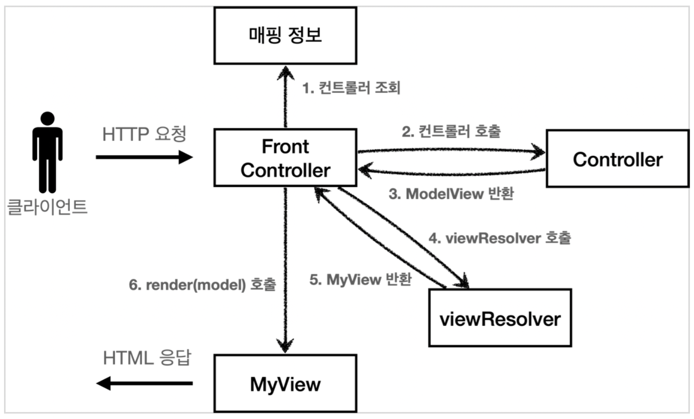
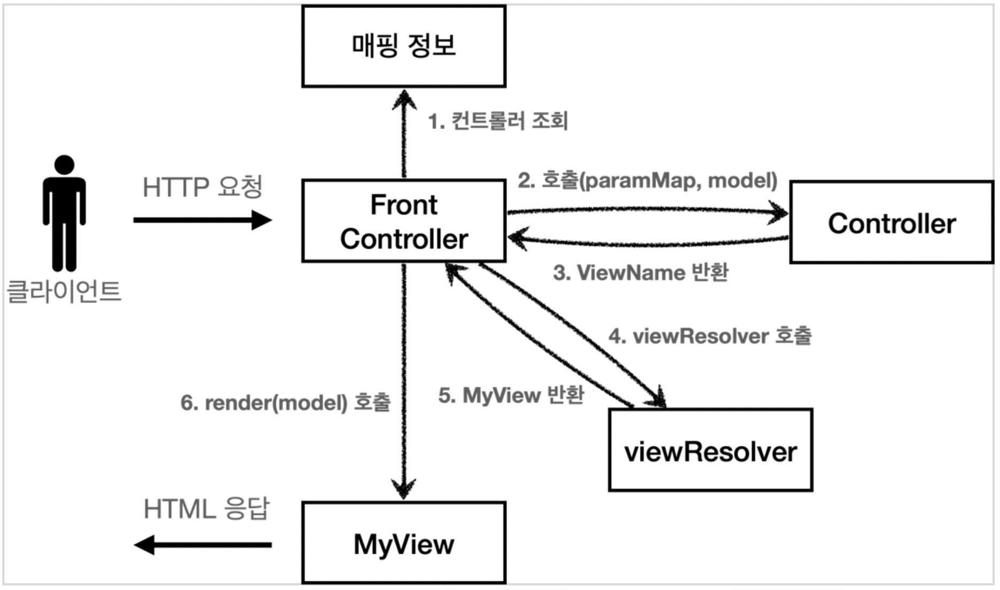

# Servlet

### frontcontroller/v3



- (기존)
    - Controller에서 servlet에 종속적인 `HttpServletRequest`를 사용
    - `request.setAttribute()`를 통해 데이터를 저장하고 View 전달까지 함
- (변경)
    - Servlet 종속성 제거 & View 경로 중복제거
    - Front-controller에서 `ModelView` 객체를 반환
    - Controller는 ModelView 객체 반환

```text
등록: http://localhost:8080/front-controller/v3/members/new-form 
목록: http://localhost:8080/front-controller/v3/members
```

### frontcontroller/v4



- (기존)
    - Controller에서 ModelView 객체 반환
- (변경)
    - 공통기능 통합

```text
등록: http://localhost:8080/front-controller/v4/members/new-form 
목록: http://localhost:8080/front-controller/v4/members
```